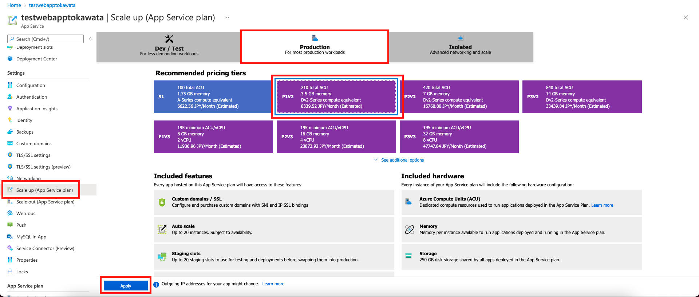
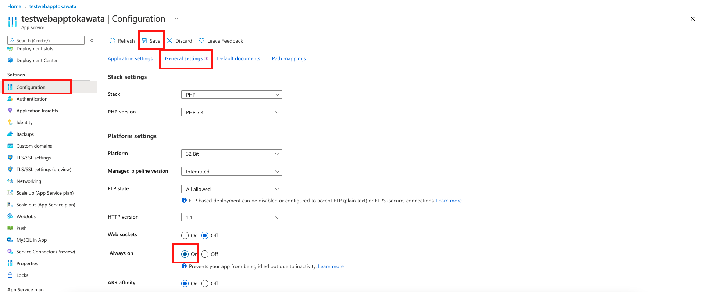

# Azure App Service の MySQL In App　において #2002 - An attempt was made to access a socket in a way forbidden by its access permissions.　と出るエラーについて

## このドキュメントの内容
Azure App Service の MySQL In App の管理画面 https://APPLICATIONNAME.scm.azurewebsites.net/phpMyAdmin/ (APPLICATIONNAME にはデプロイを行なったアプリケーション名) を表示する際、下記のエラーに遭遇したので、自身の忘備録として残しておきます。
> #2002 - An attempt was made to access a socket in a way forbidden by its access permissions.  
\- The server is not responding (or the local server's socket is not correctly configured).  
mysqli_real_connect(): (HY000/2002): An attempt was made to access a socket in a way forbidden by its access permissions.

## 解決策
- App Service の プランを Premium にスケールアップし、Always On を有効にする。

- Web アプリケーションへアクセスした後、再度管理画面を開く。この場合の注意点として、キャッシュによりきちんと表示されていない場合もあるので、同じエラーが出る場合は Command + Shift + R (Windows の場合は Ctrl + Shift + R) でハード読み込みを行う事を推奨します。

## 原因
原因としては、どうやら Web アプリケーションが一定時間リクエストを受信しない場合、App Service のインスタンスが自動的にシャットダウンし、リクエストがあるたびに再起動するために発生するもののようです。

1 つめの解決策では、インスタンスにシャットダウンさせないためのオプション「Always On」を有効にする事で、常にインスタンスが存在しているためにこのエラーを回避する事が出来るというものです。

2 つめの解決策では、シャットダウンしたインスタンスを再起動させるべく Web アプリケーションへ予めアクセスしておき管理画面へアクセスを行うというものです。私は富豪ではないのでこちらで様子見をしてみます。

## あとがき
stackoverflow にもしっかり書いてありました。
> It's simple. If you have stopped the website and started it again, you must connect to the website URL from a browser, before you can use phpMyAdmin.  
This only affects app services without Always On enabled.

https://stackoverflow.com/a/57545678/12045751
